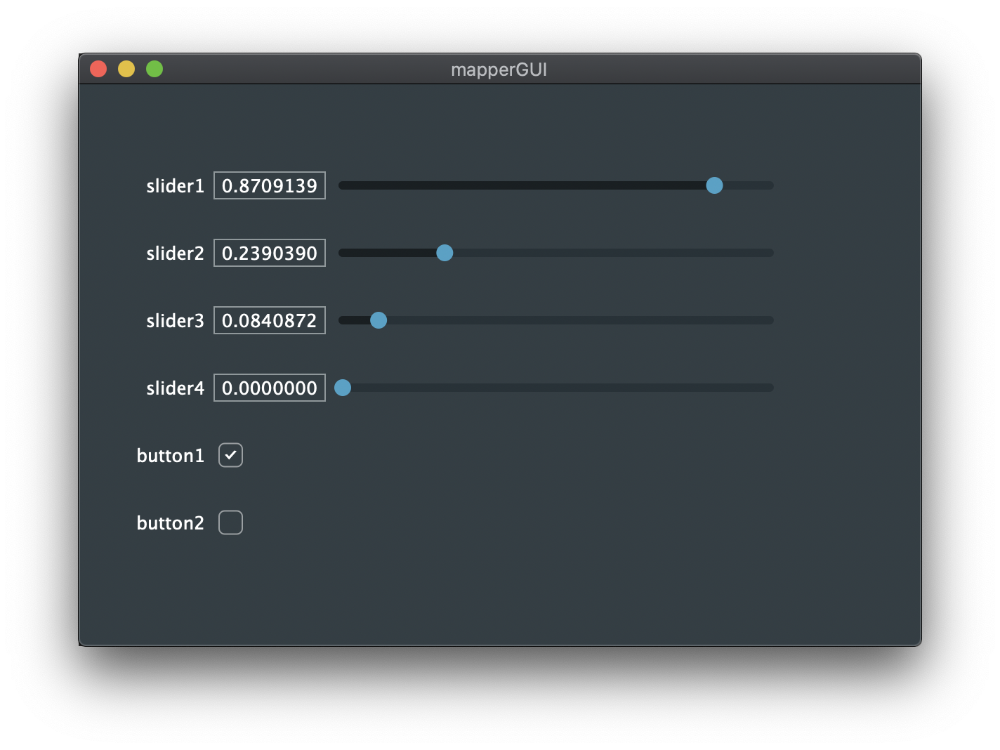

# mapperGUI
A simple JUCE-based GUI with sliders and buttons for testing libmapper applications

### Build instructions
- Install [libmapper](https://github.com/libmapper/libmapper)
- Install [JUCE](https://juce.com/)
- Build and run with Projucer
